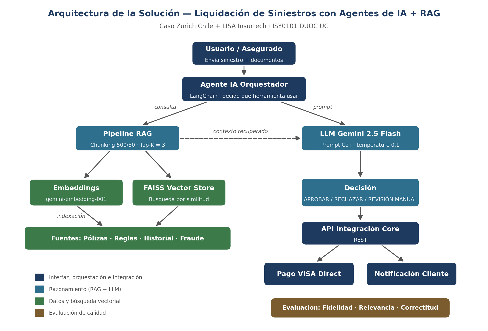
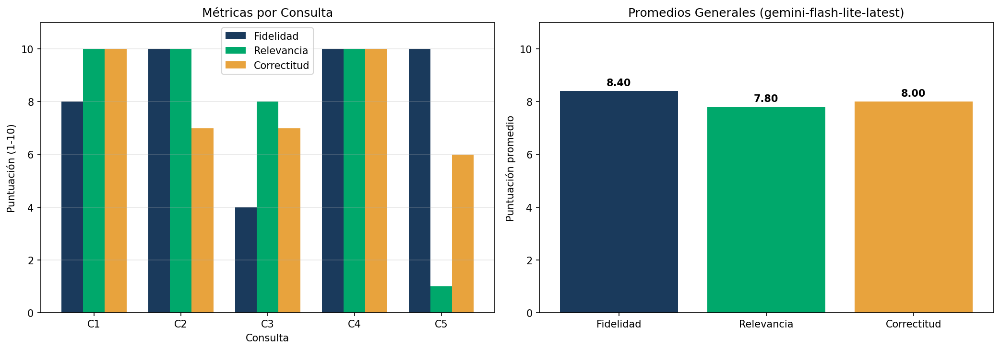

# Automatización de Liquidación de Siniestros de Salud con Agentes de IA, LLM y RAG

[](https://colab.research.google.com/drive/1NPbePeViGfA4HTc9DAMUZ8pVX0E-0qju?usp=sharing)


| | |
|---|---|
| **Caso** | Zurich Chile + LISA Insurtech |
| **Asignatura** | ISY0101 — Ingeniería de Soluciones con IA · DUOC UC |
| **Docente** | Cristián R. Araya Salazar |
| **Integrantes** | Jussara Loza · Roberto Bustamante |
| **Fecha** | 25 de septiembre de 2026 |

**Notebook ejecutable en Google Colab:** https://colab.research.google.com/drive/1NPbePeViGfA4HTc9DAMUZ8pVX0E-0qju?usp=sharing

---

## Contenido

1. [Problema](#problema)
2. [Solución propuesta](#solución-propuesta)
3. [Arquitectura](#arquitectura)
4. [Estructura del repositorio](#estructura-del-repositorio)
5. [Cómo ejecutarlo](#cómo-ejecutarlo)
6. [Pipeline paso a paso](#pipeline-paso-a-paso)
7. [Evaluación y resultados](#evaluación-y-resultados)
8. [Decisiones técnicas](#decisiones-técnicas)
9. [Limitaciones y trabajo futuro](#limitaciones-y-trabajo-futuro)
10. [Declaración de uso de IA](#declaración-de-uso-de-ia)

---

## Problema

En Zurich Chile, el **35% de los siniestros de salud requiere reembolso manual**, con un tiempo promedio de liquidación de **4,5 días**. La revisión de documentos se hace caso a caso y la detección de fraude no escala, lo que genera costos operativos altos y baja satisfacción del cliente.

## Solución propuesta

Un sistema basado en **agentes de IA + LLM + RAG** que:

- **Busca** en la base de conocimiento (pólizas, reglas de negocio y patrones de fraude) la información relevante para cada siniestro.
- **Entrega** esa información al modelo de lenguaje como contexto, para que sus decisiones se basen en documentos reales y no en suposiciones (evita "alucinaciones").
- **Razona paso a paso** (Chain-of-Thought) antes de decidir, dejando una justificación auditable.
- **Decide** entre `APROBAR`, `RECHAZAR` o `REQUIERE_REVISION_MANUAL`.
- **Mide** la calidad de sus respuestas con métricas de fidelidad, relevancia y correctitud.

Este repositorio contiene el **prototipo funcional del pipeline RAG** que sustenta la solución.

## Arquitectura



| Componente | Función | Tecnología (prototipo) |
|---|---|---|
| Agente IA | Orquesta el flujo y decide qué herramienta usar | LangChain |
| LLM | Comprende la consulta y genera la decisión | Google Gemini 2.5 Flash |
| Embeddings | Convierte los textos en vectores numéricos | gemini-embedding-001 |
| Vector Store | Almacena los vectores y busca los más parecidos | FAISS |
| API Integración | Conexión con el core (pago y notificación) | REST (propuesta) |

**Stack:** Python · Google Colab · Google Gemini API · LangChain · FAISS · pandas · matplotlib

## Estructura del repositorio

```
zurich-lisa-rag/
├── README.md
├── requirements.txt
├── .gitignore
├── notebooks/
│   └── pipeline_rag_zurich_gemini.ipynb   # Pipeline completo (12 celdas)
├── docs/
│   └── arquitectura_zurich_lisa_rag.png   # Diagrama de arquitectura (Anexo C)
├── evidencias/                            # Capturas de ejecución (Anexo B)
│   ├── README.md
│   ├── 01_instalacion.png
│   ├── ...
│   └── 11_grafico.png
└── resultados/
    ├── resultados_evaluacion.csv          # Métricas por consulta
    └── grafico_evaluacion.png             # Gráfico de resultados
```

## Cómo ejecutarlo

**Opción rápida:** haz clic en el botón **Abrir en Colab** al inicio de este README.

**Paso a paso:**

1. **Obtener una API key gratuita de Gemini**
   Entra a https://aistudio.google.com/apikey, inicia sesión con tu cuenta Google y haz clic en *Create API key*. No requiere tarjeta de crédito.

2. **Abrir el notebook**
   Usa el botón de Colab, o sube `notebooks/pipeline_rag_zurich_gemini.ipynb` a https://colab.research.google.com.

3. **Guardar la API key como secreto**
   En el menú lateral de Colab: 🔑 **Secretos** → *Agregar nuevo secret*
   - Nombre: `GEMINI_API_KEY`
   - Valor: tu API key
   - Activar **Acceso al notebook**

4. **Ejecutar**
   Menú *Entorno de ejecución → Ejecutar todas*, o celda por celda en orden.

> **Nota:** el plan gratuito de Gemini tiene un límite de consultas por minuto. El notebook incluye pausas y reintentos automáticos, por lo que la evaluación (celda 10) tarda aproximadamente 1-2 minutos. La API key nunca queda escrita en el código.

## Pipeline paso a paso

| Celda | Etapa | Qué hace |
|:---:|---|---|
| 1 | Instalación | Instala LangChain, el conector de Gemini y FAISS |
| 2 | Credenciales | Carga la API key de forma segura desde los Secretos de Colab |
| 3 | Cliente LLM | Detecta los modelos Gemini disponibles y se conecta al primero que responde |
| 4 | Corpus | Carga 8 documentos: 3 pólizas, 3 reglas de negocio y 2 patrones de fraude |
| 5 | Chunking | Divide los textos en fragmentos (500 caracteres, 50 de solapamiento) conservando su ID y tipo |
| 6 | Embeddings + FAISS | Convierte los fragmentos en vectores, los indexa y prueba una búsqueda |
| 7 | RAG básico | Recupera los 3 fragmentos más relevantes y genera una respuesta basada en ellos |
| 8 | Chain-of-Thought | Toma una decisión de cobertura razonando en 4 pasos y citando las fuentes |
| 9 | Métricas | Define la evaluación con el LLM como juez (fidelidad, relevancia, correctitud) |
| 10 | Evaluación | Evalúa 5 consultas de negocio y exporta los resultados a CSV |
| 11 | Visualización | Genera el gráfico de métricas por consulta y promedios |
| 12 | Descarga | Descarga el CSV y el gráfico |

### Flujo de una consulta

```
Consulta del usuario
      │
      ▼
Embedding de la consulta (gemini-embedding-001)
      │
      ▼
Búsqueda en FAISS → 3 fragmentos más parecidos (pólizas / reglas / fraude)
      │
      ▼
Prompt = rol + contexto recuperado + consulta
      │
      ▼
Gemini (temperature 0.1) → Decisión + justificación
```

## Evaluación y resultados

### Dataset de prueba

| # | Consulta | Respuesta esperada |
|:---:|---|---|
| C1 | ¿Está cubierta una consulta cardiológica de $85.000? | APROBAR — dentro del límite de $100.000 |
| C2 | ¿Cubren exámenes de laboratorio por $60.000? | REQUIERE REVISIÓN — excede el límite de $50.000 |
| C3 | ¿Cubren una hospitalización de $400.000? | APROBAR — dentro del límite de $500.000 |
| C4 | ¿Cubren un tratamiento estético de $200.000? | RECHAZAR — exclusión explícita |
| C5 | ¿Qué pasa si presento un siniestro 70 días después? | REQUIERE justificación escrita |

### Métricas

| Métrica | Qué mide |
|---|---|
| **Fidelidad** | Si la respuesta se basa solo en el contexto recuperado, sin inventar datos |
| **Relevancia** | Si la respuesta contesta directamente la pregunta |
| **Correctitud** | Si la decisión coincide con la respuesta esperada |

Cada métrica se puntúa de 1 a 10 usando el propio LLM como evaluador.

### Resultados



El detalle por consulta (respuesta del sistema, fuentes recuperadas y puntajes) está en [`resultados/resultados_evaluacion.csv`](resultados/resultados_evaluacion.csv).

Las capturas de cada etapa de la ejecución están en la carpeta [`evidencias/`](evidencias/).

## Decisiones técnicas

| Decisión | Justificación |
|---|---|
| **RAG en vez de fine-tuning** | Las pólizas y reglas cambian con frecuencia; con RAG basta con actualizar los documentos, sin reentrenar el modelo |
| **FAISS** | Búsqueda en memoria, rápida y sin servidor adicional; adecuada para un prototipo y para respuestas en tiempo real |
| **Chunk 500 / overlap 50** | Mantiene cada cláusula completa (sin cortar ideas) y el solapamiento evita perder información en los bordes |
| **Top-K = 3** | Aporta suficiente contexto (póliza + regla relacionada) sin llenar el prompt de información irrelevante |
| **Temperature 0.1** | Respuestas consistentes y poco "creativas", necesario en decisiones reguladas |
| **Chain-of-Thought** | El razonamiento explícito permite auditar por qué se aprobó o rechazó un siniestro |
| **Metadatos por fragmento** | Cada respuesta indica de qué documento salió (trazabilidad) |
| **Gemini API** | Plan gratuito suficiente para el prototipo y compatible con LangChain |

## Limitaciones y trabajo futuro

**Limitaciones**
- El corpus es simulado (8 documentos); falta validar con pólizas y siniestros reales.
- Las métricas usan al mismo LLM como evaluador, lo que puede introducir sesgo.
- Casos de fraude sofisticado o coberturas ambiguas siguen requiriendo revisión humana.
- El plan gratuito de la API limita la cantidad de consultas por minuto.

**Trabajo futuro**
- Ampliar el corpus con pólizas reales y un dataset de evaluación más grande.
- Incorporar trazabilidad y monitoreo de las ejecuciones (por ejemplo, LangSmith).
- Implementar el agente orquestador completo con herramientas de clasificación documental, extracción y detección de fraude.
- Crear una interfaz de usuario (por ejemplo, Streamlit) para cargar siniestros.

## Declaración de uso de IA

Se utilizaron asistentes de IA como apoyo en la depuración de código y en la estructuración de la documentación. El análisis, las decisiones técnicas y las conclusiones fueron revisados y validados por los integrantes del equipo.

## Referencias

- Lewis, P. et al. (2020). *Retrieval-Augmented Generation for Knowledge-Intensive NLP Tasks.* NeurIPS 33, 9459–9474.
- LangChain. Documentación oficial: https://python.langchain.com/
- Google. Gemini API: https://ai.google.dev/
- LISA Insurtech. (2025). *Media Kit LISA Claims.* https://lisa-insurtech.com/
- Zurich Insurance Group. (2024). *Cómo Zurich Chile aceleró los pagos de siniestros con IA.* https://www.zurich.com/
